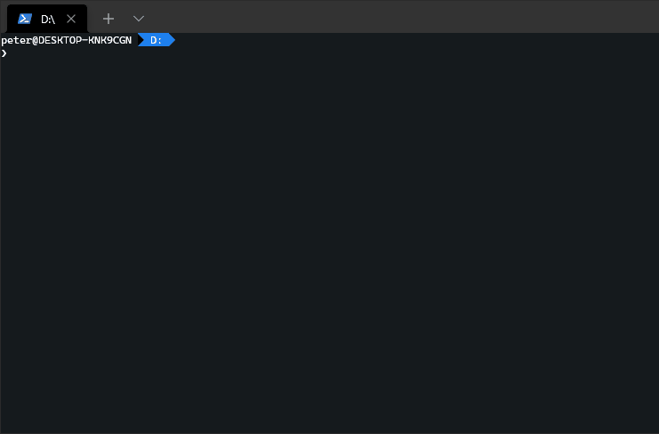

# Command Line Interface for ConfigCat

[](https://github.com/configcat/cli/actions/workflows/ci.yml)

The ConfigCat Command Line Interface allows you to interact with the ConfigCat Management API via the command line. It supports most functionality found on the ConfigCat Dashboard. You can manage ConfigCat resources like Feature Flags, Targeting / Percentage rules, Products, Configs, Environments, and more.



See the <a target="_blank" href="https://configcat.github.io/cli/">command reference documentation</a> for more information about each available command.

## About ConfigCat
ConfigCat is a feature flag and configuration management service that lets you separate releases from deployments. You can turn your features ON/OFF using <a href="https://app.configcat.com" target="_blank">ConfigCat Dashboard</a> even after they are deployed. ConfigCat lets you target specific groups of users based on region, email or any other custom user attribute.

ConfigCat is a <a href="https://configcat.com" target="_blank">hosted feature flag service</a>. Manage feature toggles across frontend, backend, mobile, desktop apps. <a href="https://configcat.com" target="_blank">Alternative to LaunchDarkly</a>. Management app + feature flag SDKs.

## Getting Started
The following instructions will guide you through the first steps to start using this tool.

### Installation
Distribution via package managers is not yet available, however we plan publishing packages to <a target="_blank" href="https://snapcraft.io/">snapcraft.io</a>, <a target="_blank" href="https://community.chocolatey.org/packages">Chocolatey</a>, <a target="_blank" href="https://brew.sh">Homebrew</a>, and <a target="_blank" href="https://www.docker.com/">docker</a> in the future.

In the meantime, you can download the binaries directly from [GitHub Releases](https://github.com/configcat/cli/releases).

#### Install Script
You can install the CLI by executing an install script on Unix platforms. 
```bash
curl -fsSL "https://raw.githubusercontent.com/configcat/cli/main/scripts/install.sh" | bash
```

By default, the script downloads the OS specific artifact from the latest [GitHub Release](https://github.com/configcat/cli/releases) with `curl` and moves it into the `/usr/local/bin` directory.

It might happen, that you don't have permissions to write into `/usr/local/bin`, then you should execute the install script with `sudo`.

```bash
curl -fsSL "https://raw.githubusercontent.com/configcat/cli/main/scripts/install.sh" | sudo bash
```

The script accepts the following input parameters:

Parameter | Description | Default value
--------- | ----------- | -------------
`-d`, `--dir` | The directory where the CLI should be installed. | `/usr/local/bin`
`-v`, `--version` | The desired version to install. | `latest`
`-a`, `--arch` | The desired architecture to install. | `x64`

The possible **architecture** values for Linux: `x64`, `musl-x64`, `arm`, `arm64`.

> For macOS, the architecture is fixed to `x64`, but we plan the support of Apple silicon in the future.

**Usage examples**:

*Custom installation directory*:
```bash
curl -fsSL "https://raw.githubusercontent.com/configcat/cli/main/scripts/install.sh" | bash -s -- -d=/path/to/install
```

*Install a different version*:
```bash
curl -fsSL "https://raw.githubusercontent.com/configcat/cli/main/scripts/install.sh" | bash -s -- -v=1.4.2
```

*Install with custom architecture*:
```bash
curl -fsSL "https://raw.githubusercontent.com/configcat/cli/main/scripts/install.sh" | bash -s -- -a=arm
```

### Configuration
After a successful installation, the CLI must be configured with your <a target="_blank" href="https://app.configcat.com/my-account/public-api-credentials">ConfigCat Management API credentials</a>.


#### Environment Variables
The CLI can read your credentials from the following environment variables.

Name | Description |
--------- | ----------- |
`CONFIGCAT_API_HOST` | The Management API host. (default: api.configcat.com) | 
`CONFIGCAT_API_USER` | The Management API basic authentication username. |
`CONFIGCAT_API_PASS` | The Management API basic authentication password. | 

When any of these environment variables are set, the CLI will use those over their local values set by the `configcat setup` command.

## Useful links
- [Documentation](https://configcat.com/docs)
- [ConfigCat](https://configcat.com)
- [Blog](https://configcat.com/blog)
